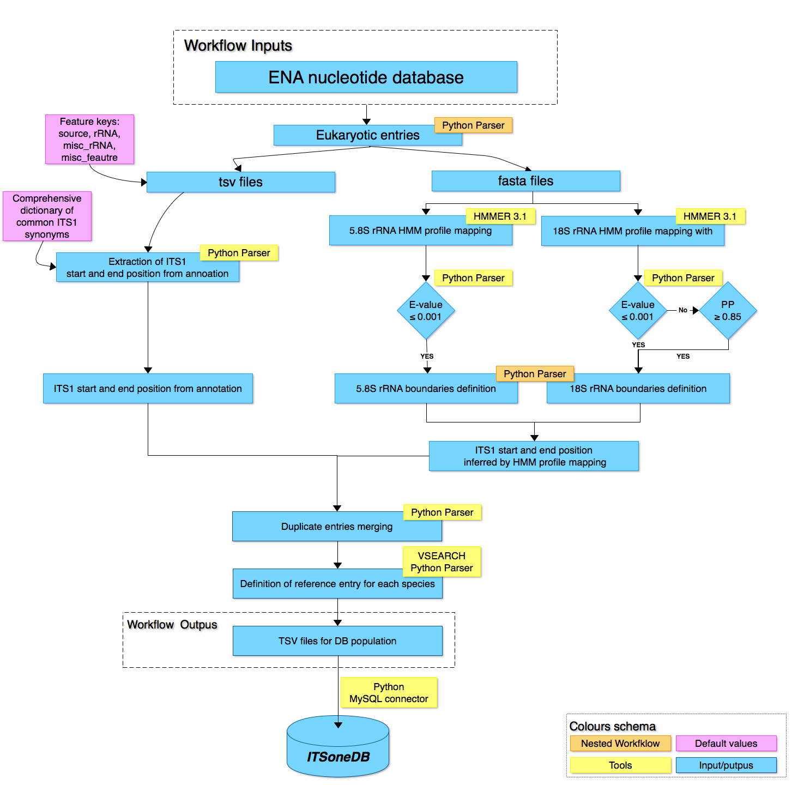

# ITSoneDB population pipeline

___
**ITSoneDB** is a database collecting Eukayotic ITS1 sequences and consistent taxonomic annotations. It is available at [http://itsonedb.cloud.ba.infn.it/](http://itsonedb.cloud.ba.infn.it/). 
___
## RATIONALE  
<div align=justify>The pipeline designed for ITSoneDB population integrates <em>ad-hoc</em> Python and BASH scripts and third-party tools (See the figure below).

1. In the initial step the ENA entries are locally downloaded and eukaryotic entries are extracted.  

2. From each entry specific information (i.e. accession number, version, description line and annotation under specific keys) are pulled out and stored in a TSV file and consistent sequence data are annotated in FASTA files. TSV and FASTA files are analyzed by two parallel procedures to extract or to infer the ITS1 location. The TSV files are parsed out to extract the annotation relative to ITS1 boundaries by means of a commonly used ITS1 synonyms dictionary.
   
3. In parallel, HMM profiles for 18S and 5.8S rRNA genes are mapped on FASTA files by means of hmmsearch (HMMER 3.1) (right diagram part).  The ITS1 boundaries information obtained by both procedures are merged in order to produce the files needed to populate the database.</div>

___


___

## REQUIREMENTS
1. The **HMMER** is required (for conda installation info see [https://anaconda.org/bioconda/hmmer](https://anaconda.org/bioconda/hmmer)).
2. The Species Representative Entry Identification procedure require **VSEARCH** (for installation info see [https://github.com/torognes/vsearch](https://github.com/torognes/vsearch)).

## USAGE
Following the instruction to execute the scripts:
```
$./ITSoneDB_upgrade_pipeline.sh
        -s full path directory containing managed scripts
        -x full path auxiliary files directory
        -r full path previous releases directory
        -c cpus number
        
$./ETL_population_pipeline.sh
        -s full path directory containing managed scripts
        -n release number
        -p previous release number
        -r full path releases directory
        
```
Auxiliary files are 16S and 5.8S HMM models and txt file containing ITS1 synonyms dictionary.
 
